# Prueba técnica - Agencia de viajes

### Usuario y Contraseña

1. **Usuario:** `hackaboss`
2. **Contraseña:** `1234`

Las credenciales son las mismas para el Swagger!

Se está desarrollando una aplicación que simula la gestión de una agencia de viajes. En esta aplicación, se manejan diferentes hoteles, y cada hotel tiene varios tipos de habitaciones, como individual, doble y triple. Según las instrucciones, se debe crear un hotel por cada tipo de habitación disponible en ese hotel. Por otro lado, los vuelos se crean solo de ida, si el usuario quiere otro vuelo de vuelta, tendrá que crear otro con otro código diferente al de ida con los nuevos datos de la reserva.

# Explicación de la aplicación
***
## EndPoints (APIs)

Explicación de cada uno de los endpoints de la aplicación

## Hoteles
****
## EndPoints:

### Método POST (Este método tiene que estar autenticado el empleado)
***

http://localhost:8080/agency/hotels/new

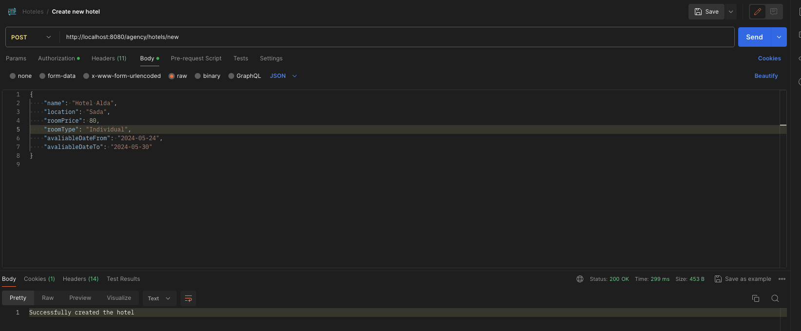

En este endpoint se van a generar todos los hoteles mediante la siguiente request:

```json
{
  "name": "Hotel Alda",
  "location": "Sada",
  "roomPrice": 80,
  "roomType": "Individual",
  "avaliableDateFrom": "2024-05-24",
  "avaliableDateTo": "2024-05-30"
}
```

En el contexto mencionado anteriormente, la estrategia consiste en generar un hotel para cada tipo de habitación disponible. Esto implica que al realizar una solicitud para crear un hotel, se incluirán también los datos asociados a cada tipo de habitación. De esta manera, al crear el hotel, la información se distribuirá automáticamente en las respectivas tablas de la base de datos, asegurando que los datos de cada habitación estén debidamente registrados y asociados al hotel correspondiente.

La response de la request anterior es la siguiente:

-Successfully created the hotel.

### Método GET (Listar todos los hoteles)
***

Este método nos permite observar todos los hoteles y aparte ver cuáles están o no reservados.

http://localhost:8080/agency/hotels

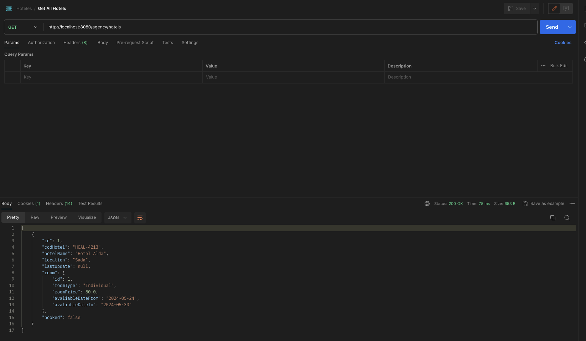


En el caso de que no hubiese hoteles en la base de datos o estos estuviesen eliminados, tendríamos la siguiente respuesta:

-There are no active hotels in the database.

### Método GET (Listar los hoteles en un determinado rango de fechas, lugar y buscar por disponibilidad)
***

Este método nos permite devolver hoteles mediante un rango de fechas, lugar y buscar si estos están disponibles.

http://localhost:8080/agency/hotels/search?avaliableDateFrom=2024-05-10&avaliableDateTo=2024-05-30&location=Sada&isBooked=false

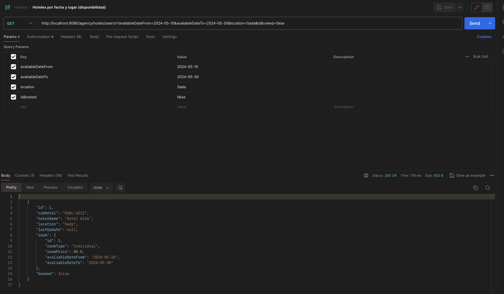

En el caso de que el hotel o los hoteles que estuviésemos buscando no estuviesen en las susodichas fechas, recibiríamos como respuesta lo siguiente:

-There are no hotels with these criteria in the database.

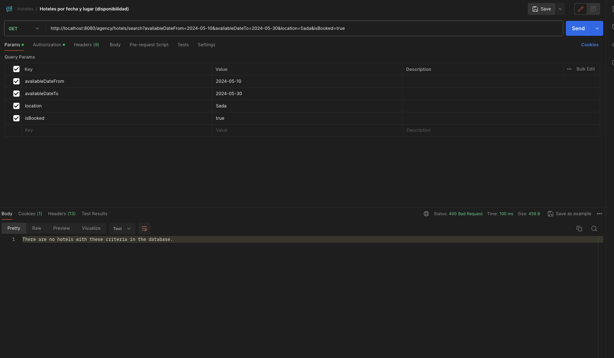

### Método GET por ID.
***

Este método simplemente busca hoteles por el ID, en el caso de que no encuentre el hotel por el ID seleccionado, nos dará un error

http://localhost:8080/agency/hotels/1

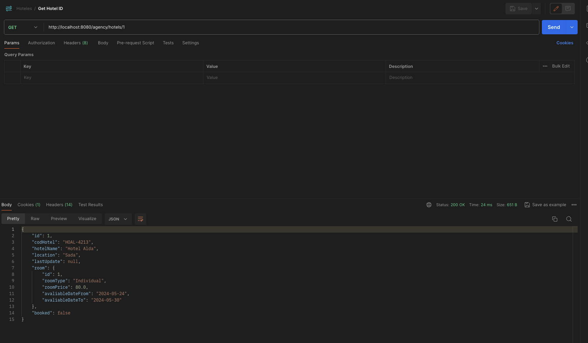

Si no encuentra un hotel, obtenemos la siguiente respuesta:

-The hotel with ID 2 does not exist in the database.

### Método PUT. Actualizar el hotel.
***

En este método solo podemos actualizar el nombre o la localización del hotel. La actualización se realiza a través del ID del hotel

```json
{

"name": "Hotel Betanzos",
"location": "Betanzos"
}
```
Si todo ha salido correcto, aparte de actualizarse el nombre y la localización, también se actualizará el código alfanumérico del hotel

Si el hotel que intentamos actualizar no se encuentra en la base de datos, nos marcará el siguiente error:

Hotel not found in the database.

### Método DELETE
***

http://localhost:8080/agency/hotels/1
Este método se encarga de hacer un borrado lógico, en la base de datos se encuentran dos columnas, una llamada (is_Deleted) y (last_deleted_date), en las cuales mediante una flag (0 - 1) nos permiten observar si el hotel se encuentra borrado o no. Para eliminar un hotel se hace mediante su ID. En el caso de que un hotel tenga una reserva, este no va a poder ser eliminado hasta que se elimine primero la reserva.

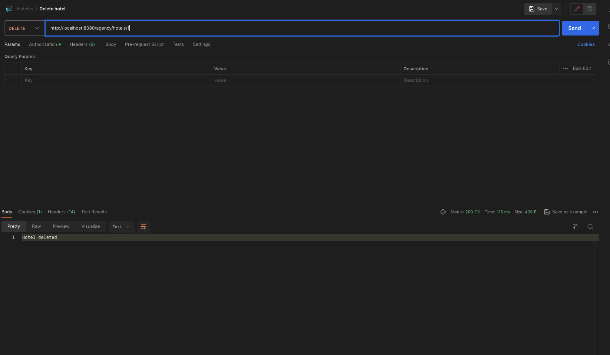

En el caso de que intentemos borrar un hotel que no se encuentra en la base de datos, obtendremos el siguiente error:

-The hotel with ID 3 was not found in the database.

## Vuelos
****

Debido a que los endpoints son prácticamente los mismos a los de los hoteles, solo se usaran screenshots si es realmente necesario explicar algo.

### Método POST (Creación de vuelo).
***

Este método permite la creación de un vuelo, simplemente se ingresan los diferentes parámetros mediante el JSON.

http://localhost:8080/agency/flight/new

```json
{

"arrival": "Sada",
"departure": "Madrid",
"date": "2024-05-24"
}
```
Hago el vuelo de una manera para que concuerde con el hotel creado anteriormente.

La respuesta de este endpoint es la siguiente:

Successfully created flight

### Método GET (obtener la lista de todos los vuelos)
***
Mediante este método obtenemos todos los vuelos que se encuentran disponibles en la base de datos.

http://localhost:8080/agency/flights

```json
[
{
"id": 1,
"codFlight": "SA-6190",
"departure": "Madrid",
"arrival": "Sada",
"date": "2024-05-24",
"lastUpdate": null,
"deleted": false
}
]
```

En este caso solo se encuentra un vuelo en la base de datos.

### Método GET (obtener la lista de vuelos en función de fechas, lugar de destinos y origen)
***

En este método obtenemos los vuelos mediante un rango de fechas, origen, destino. En el caso de que sea correcto nos dará la siguiente respuesta:

http://localhost:8080/agency/flights/search?avaliableDateFrom=2024-05-24&avaliableDateTo=2024-05-25&arrival=Sada&departure=Madrid

```json

[
{
"id": 1,
"codFlight": "SA-6190",
"departure": "Madrid",
"arrival": "Sada",
"date": "2024-05-24",
"lastUpdate": null,
"deleted": false
}
]
```

http://localhost:8080/agency/flights/search?avaliableDateFrom=2024-05-20&avaliableDateTo=2024-05-25&arrival=Coruna&departure=Madrid

Y si es incorrecto, obtenemos la respuesta indicándonos que está mal:

No flights match the specified criteria in the database.

### Método GET(método para obtener los vuelos por ID)
***

En este caso obtenemos un vuelo mediante su ID. En el caso de no encontrar un vuelo por su correspondiente ID obtenemos la siguiente response:

http://localhost:8080/agency/flights/{id}

Flight with ID 12 not found in the database.

### Método PUT(Método para actualizar los vuelos)
***

En este método lo que vamos a hacer es actualizar los vuelos, en este caso lo que vamos a actualizar es:

```json

{
"arrival": "Sada",
"departure": "Madrid",
"date": "2024-04-24"
}
```
Y como podemos comprobar mediante él antes y él después, los datos han sido actualizados sin ningún problema.

De nuevo, si se intenta actualizar un vuelo inexistente, obtendremos como respuesta la siguiente response:

Flight with ID 3 not found in the database.

### Método DELETE(Método para eliminar los vuelos)
***

Este método se encarga de hacer un borrado lógico, en la base de datos se encuentran dos columnas, una llamada (is_Deleted) y (last_deleted_date), en las cuales mediante una flag (0 - 1) nos permiten observar si el hotel se encuentra borrado o no. Para eliminar un vuelo se hace mediante su ID. En el caso de que un vuelo tenga una reserva, este no va a poder ser eliminado hasta que se elimine primero la reserva.

http://localhost:8080/agency/flights/{id}

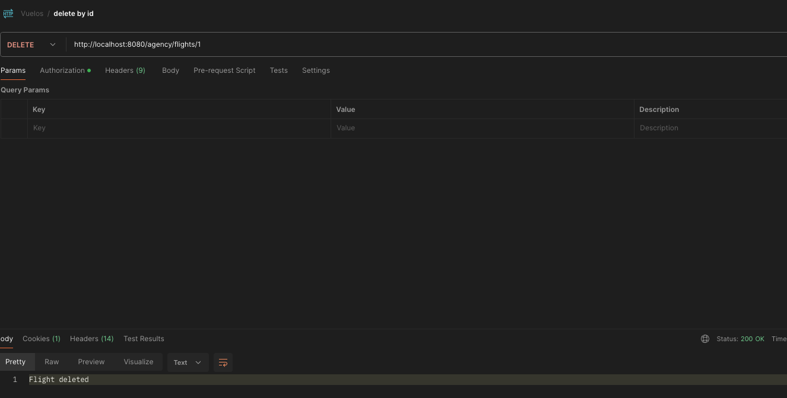

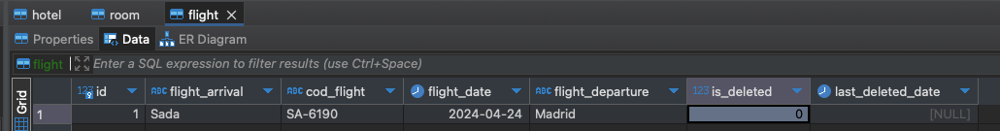

Si todo ha salido correcto, la respuesta que obtendremos será la siguiente:

Flight deleted

En el caso de que intentemos borrar un vuelo que no se encuentra en la base de datos, la siguiente response:

The flight is not found in the database.

## Reserva de vuelos
****

El funcionamiento de la resserva de vuelos es muy parecido a lo que llevamos hecho hasta ahora. Por ende obtare por incluir imágenes cuando sea estrictamente necesario.

## EndPoints:

### Método POST (creación de la reserva)
***

http://localhost:8080/agency/flight-booking/new

```json
{
"date": "2024-04-24",
"departure": "Madrid",
"arrival": "Sada",
"codFlight": "SA-6190",
"seatType": "Economy",
"price": 60,
"passengers": [
{
"name": "Diego",
"lastName": "Millan",
"email": "diego@diego.com",
"passport": "DM123456B",
"age": 27
}
]
}
```
El precio en este caso se estipula que es de 60 euros, pero más adelante veremos que "Economy = 60 euros" y "Premium = 120 euros".

Podemos hacer una reserva del mismo vuelo, pero con otra persona diferente, en el caso de que volvamos a ejecutar el mismo JSON obtendremos el siguiente mensaje:

At least one user already has an active reservation for the specified flight on the specified date.

### Método GET (devuelve todas las reservas)
***

En este caso, las reservas solo podrán ser vistas por el empleado autenticado, no por un usuario normal. La response que obtenemos es la siguiente:

http://localhost:8080/agency/flight-booking/all

```json
[
{
"id": 1,
"date": "2024-04-24",
"departure": "Madrid",
"arrival": "Sada",
"codFlight": "SA-6190",
"peopleQ": 1,
"seatType": "Economy",
"price": 60.0,
"passengers": [
{
"id": 1,
"name": "Diego",
"lastName": "Millan",
"email": "diego@diego.com",
"passport": "DM123456B",
"age": 27,
"flightReservations": [
1
],
"hotels": []
}
],
"flight": {
"id": 1,
"codFlight": "SA-6190",
"departure": "Madrid",
"arrival": "Sada",
"date": "2024-04-24",
"lastUpdate": "2024-01-15",
"deleted": true
},
"lastUpdate": null,
"deleted": false
}
]
```

### Método GET (este método nos devuelve la reserva por ID)
***

En este se va a buscar una reserva, y como podemos observar se va a realizar mediante un ID.

http://localhost:8080/agency/flight-booking/get/{id}

En el caso de que intentemos buscar por un ID que no se encuentre en la base de datos, obtendremos el siguiente error:

The flight reservation with ID 2 is not found in the database.

### Método PUT (método para actualizar a través del ID)
***

En este método podremos actualizar a través del ID la categoría en la que el pasajero va a viajar, tenemos dos opciones comentadas anteriormente:

"Economy = 60 euros" y "Premium = 120 euros".

Este cambio se refleja automáticamente en la base de datos.

Base de datos sin actualizar:
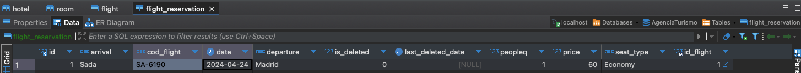

Ahora la tabla actualizada:

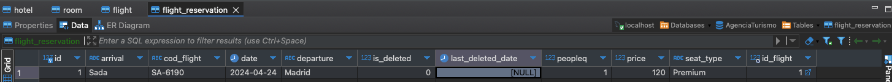

Este cambio se realiza mediante el siguiente JSON:

```json
{
"seatType": "Premium"
}
```

La respuesta que obtenemos si ponemos el "seatType" incorrecto es la siguiente:

Invalid seat type. Choose between 'Economy' and 'Premium'.

### Método DELETE (método para eliminar un vuelo)
***

Es prácticamente idéntica a la hora de borrar un vuelo o un hotel. Simplemente, buscaremos por el ID correspondiente y le daremos a eliminar.

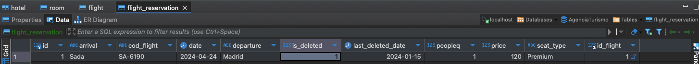

Si el ID no existe en la BBDD obtenemos la siguiente response:

The flight reservation with ID 3 is not found in the database.

## Reserva de Hoteles
***

## EndPoints:

### Método POST (método para crear una reserva)

En este método igual que anteriormente también se crea el usuario, en caso de que este ya se encuentre creado no se volverán a crear.

En el caso de que la habitación del hotel no concuerde con la habitación a la hora de hacer una reserva, obtendremos el error:

The specified room for the reservation was not found.

Para crear una reserva debemos obtener el código del hotel correcto, en caso de que no sea el correcto obtendremos el siguiente error:

The specified hotel does not exist or has been deleted.

En el caso de que sea todo correcto, obtendremos la siguiente response:

The total price of the reservation is: 480.0 € (Un cálculo del precio de la habitación por el número de días que la persona se va a alojar en ella).

Tenemos tres tipos de habitaciones principales (Individual, Doble o Triple).

Request usada a la hora de la creacion de la reserva:

```json
{
"dateFrom":"2024-05-24",
"dateTo": "2024-05-30",
"location": "Sada",
"codHotel": "HOAL-4213",
"roomType": "Individual",
"hosts": [
{
"name": "Diego",
"lastName": "Millan",
"email": "diego@diego.com",
"passport": "DM123456B",
"age": 27
}
]
}
```

### Método GET (Obtener las reservas por el ID)
***

Este método es idéntico al de la reserva de vuelos, por ende vamos a pasar directamente a la respuesta del JSON:

```json
"id": 1,
"codHotel": "HOAL-4213",
"dateFrom": "2024-05-24",
"dateTo": "2024-05-30",
"nights": 6,
"peopleQ": 1,
"price": 480.0,
"roomType": "Individual",
"users": [
{
"id": 1,
"name": "Diego",
"lastName": "Millan",
"email": "diego@diego.com",
"passport": "DM123456B",
"age": 27,
"flightReservations": [
{
"id": 1,
"date": "2024-04-24",
"departure": "Madrid",
"arrival": "Sada",
"codFlight": "SA-6190",
"peopleQ": 1,
"seatType": "Premium",
"price": 120.0,
"passengers": [
{
"id": 1,
"name": "Diego",
"lastName": "Millan",
"email": "diego@diego.com",
"passport": "DM123456B",
"age": 27,
"flightReservations": [
1
],
"hotels": [
1
]
}
],
"flight": {
"id": 1,
"codFlight": "SA-6190",
"departure": "Madrid",
"arrival": "Sada",
"date": "2024-04-24",
"lastUpdate": "2024-01-15",
"deleted": false
},
"lastUpdate": "2024-01-15",
"deleted": false
}
],
"hotels": [
1
]
}
],
"hotel": {
"id": 1,
"codHotel": "HOAL-4213",
"hotelName": "Hotel Alda",
"location": "Sada",
"lastUpdate": "2024-01-15",
"room": {
"id": 1,
"roomType": "Individual",
"roomPrice": 80.0,
"avaliableDateFrom": "2024-05-24",
"avaliableDateTo": "2024-05-30"
},
"booked": true
},
"updated": null,
"deleted": false
}
```

Si la reserva no existe, vamos a obtener el siguiente error:

The reservation with ID 2 does not exist in our database.

## Método GET (Obtener todas las reservas)
***

Gracias a este método obtendremos todas las reservas que se encuentran en la base de datos. Como actualmente solo hay una reserva, pues mostrara lo mismo que el método anterior de obtener mediante un ID.

## Método PUT (Actualizar la reserva por ID)
***

Mediante este método vamos a actualizar la información de la reserva, aquí podremos editar dos datos principales, la fecha de inicio y la fecha final

Request:
```json
{
"dateFrom": "2024-04-10",
"dateTo": "2024-04-20"
}
```

### Método DELETE (Eliminar reserva)
***

Este método es muy parecido al borrado de la reserva de vuelos.

Eliminación de una reserva:

En el caso de que estemos intentando borrar una reserva de un hotel que no se encuentre en la base de datos, obtendremos la siguiente respuesta:

The reservation with ID 2 does not exist in the database.

## Posibles mejoras para Sprints futuros
***

1. Controlar a los usuarios mediante un DNI que fuese único para tener un mayor control sobre el usuario de la página y evitar suplantaciones de identidad.

2. Integrar un sistema de notificaciones para informar a los usuarios sobre confirmaciones de reserva, cambios o cancelaciones.

3. Notificar a los usuarios cuando un hotel o vuelo esté próximo a alcanzar su capacidad máxima.

4. Historial de reservas y actividades.
